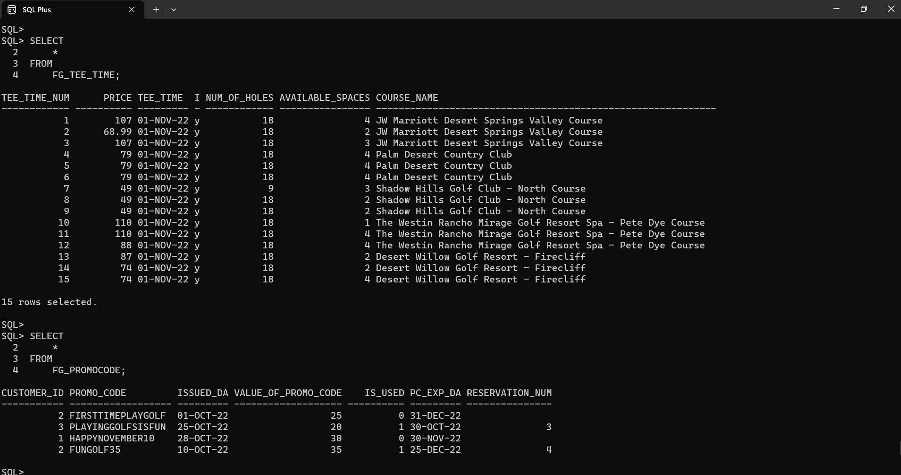

# golfreservationdatabase
In Fall 2022, I embarked on a journey to create a comprehensive database management system, named Forever Golf, using SQL. This innovative system is meticulously designed to enhance the efficiency and robustness of golf reservation management. 
Every table in the database, marked with the prefix 'FG' for easy recognition, serves a unique function in the system. They help manage diverse aspects such as customer information, booking details, promotional codes, and customer reviews. 
Forever Golf is more than just a booking system; it's a tool that streamlines operations, delivers customer satisfaction, and ultimately supports the growth of golf clubs globally.


## Getting Started

These instructions will help you get the project up and running on your local machine for development and testing purposes.

### Prerequisites

Before you begin, ensure you have installed:
- Your preferred SQL server or database
- An appropriate SQL client for running SQL scripts (optional)

### Setting Up

To set up the project, follow these steps:

1. Clone the repository to your local machine:
    ```
    git clone https://github.com/yourusername/yourrepository.git
    ```

2. Navigate to the `BuildDB` folder:
    ```
    cd yourrepository/BuildDB
    ```

3. Run the `builddatabase.sql` script to create the database structure:
    ```
    your_sql_command builddatabase.sql
    ```
   Replace `your_sql_command` with the appropriate command for your SQL server or client.

4. Navigate to the `Populate` folder:
    ```
    cd ../Populate
    ```

5. Run the `populatedata.sql` script to populate the database with data:
    ```
    your_sql_command populatedata.sql
    ```

6. Navigate to the `Verify` folder:
    ```
    cd ../Verify
    ```

7. Run the `verify.sql` script to verify the data in the database:
    ```
    your_sql_command verify.sql
    ```

## Development

This project was developed in the Fall of 2022. It was built from scratch, and the development process was carried out in multiple stages. The process included building the database, populating it with data, and verifying the data.

## Contributing

Contributions are always welcome! If you want to contribute to this project, please follow these steps:

1. Fork the project.
2. Create your feature branch: `git checkout -b feature/YourFeature`
3. Commit your changes: `git commit -m 'Add some feature'`
4. Push to the branch: `git push origin feature/YourFeature`
5. Open a pull request.

## Contact

If you want to contact me you can reach me at `your_email@yourdomain.com`.

## License

This project uses the following license: [License Name](https://link-to-license.com).
